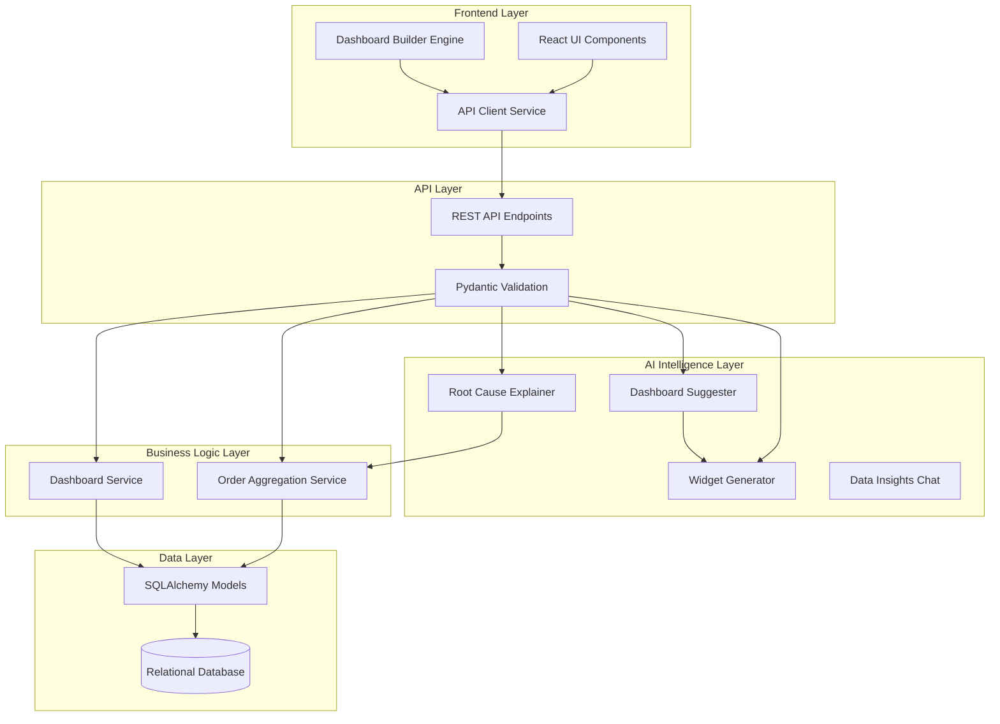

# Design Document: Custom Dashboard Builder

## Overview

The Custom Dashboard Builder is a production-quality system that enables users to design, visualize, and monitor real-time business metrics dynamically. The system provides a complete solution for dynamic data visualization, featuring a powerful AI Intelligence Layer capable of auto-generating full layouts, parsing natural language to construct custom widgets, explaining data anomalies ("Why is this happening?"), and conversing strictly with live business orders.

The architecture follows a clean, modular design with separation of concerns across presentation (React + Zustand), business logic (FastAPI), AI processing (Gemini 2.5 Flash), and data layers (PostgreSQL/Alembic), providing a highly scalable, maintainable, and production-ready enterprise application.

## Key Features
- **Interactive Dashboard Builder**: 12-column drag-and-drop grid layout using `react-grid-layout` allowing custom sizing and positioning.
- **7 Dynamic Widget Types**: Native rendering for KPI Cards, Bar Charts, Line Charts, Area Charts, Pie Charts, Scatter Plots, and Data Tables.
- **AI Widget Generator**: Natural Language to Chart configuration. Simply type "Show me revenue by product as a pie chart" and the widget is automatically assembled and populated with live data.
- **AI Dashboard Suggester**: A one-click "magic wand" that architecturally crafts a beautiful 6-widget starter layout perfectly mapped to the database schema when starting from an empty canvas.
- **AI Root Cause Explainer**: A built-in "Why?" sparkly button on every widget that instantly analyzes statistical anomalies against raw tabular context to provide immediate business-intelligence.
- **Data Insights Chat**: A conversational Data Analyst sidebar panel trained directly on your latest Customer Orders.
- **Live Data Aggregation Engine**: Real-time server-side processing mapping highly customizable metrics (sum, avg, count) strictly via SQLAlchemy AST mappings.
- **Order Management CRUD**: A dedicated Data page featuring extensive pagination, editing, and deleting capabilities for raw Customer Orders.
- **Global Time Filtering**: A synchronized control allowing instant dashboard-wide data recalculations for dynamic date ranges (e.g. 'Today', 'Last 30 Days').
- **Graceful API Key Rotation**: Automatic queue pooling multiple Gemini keys to transparently prevent downtime from severe rate-limits (HTTP 429).
- **Glassmorphic UI Themes**: Smooth user-selected toggling between vibrant Light modes and beautiful, sleek Dark styling.

## Architecture

The system follows a layered architecture with clear separation of concerns:



## Main Algorithm/Workflow

The core AI Widget Generation and Render workflow follows this execution sequence:


## Components and Interfaces

### Component 1: AI Intelligence Layer

**Purpose**: Translates natural language and system state into rigorous database configurations and insights.

**Interface**:
```python
class AILayer:
    async def generate_widget(self, prompt: str) -> WidgetCreate
    async def suggest_dashboard(self) -> DashboardCreate
    async def explain_insight(self, widget: ExplainWidgetRequest) -> Dict[str, str]
    async def chat_insights(self, message: str) -> Dict[str, str]
```

**Responsibilities**:
- Convert human language into strict widget JSON structures (`x_axis`, `y_axis`, `metric`).
- Provide Root Cause Explanations cross-referencing aggregate data with raw context.
- Manage safe API key rotation when rate limits are hit.
- Automatically position grids mathematically out into a 12-column coordinate system.

### Component 2: Order Aggregation Engine

**Purpose**: Processes massive datasets dynamically according to generalized widget schemas.

**Interface**:
```python
class OrderAggregationService:
    async def get_aggregate_data(self, db: AsyncSession, metric: str, aggregation: str, date_range: str, group_by: Optional[str]) -> Dict[str, Any]
    async def get_table_data(self, db: AsyncSession, columns: List[str], sort_by: str, sort_dir: str, page: int) -> Dict[str, Any]
```

**Responsibilities**:
- Bind generic JSON configurations directly to SQLAlchemy AST objects (`func.sum`, `func.count`).
- Safely sanitize strings against allowed `COLUMN_MAP` values avoiding SQL injection.
- Process time-series filtering on the fly (`today`, `last_30_days`).

### Component 3: Dashboard Layout Engine (Frontend)

**Purpose**: Controls the workspace DOM and bounds validation of the interactive graph matrix.

**Interface**:
```javascript
export default function DashboardCanvas({ widgets, editable })
function hasMinimalConfig(widget)
```

**Responsibilities**:
- Mange `react-grid-layout` bounds within responsive breakpoints (Mobile to Desktop).
- Pre-validate widget configurations (Gatekeeping) before attempting data fetches to prevent crash chains.
- Escalate localized `createPortal` models for tooltips and AI explainers breaking out of CSS transforms.

## Data Models

### Model 1: CustomerOrder

```python
class CustomerOrder(Base):
    id: UUID = Field(primary_key=True)
    first_name: str = Field(max_length=100)
    last_name: str = Field(max_length=100)
    product: str
    quantity: int = Field(ge=1)
    unit_price: Float
    total_amount: Float
    status: str
    order_date: datetime
```

**Validation Rules**:
- `total_amount` is inherently computable.
- Product enum enforcement (e.g. "MacBook Pro 16", "iPhone 15 Pro").

### Model 2: Dashboard Widget

```python
class Widget(Base):
    id: UUID = Field(primary_key=True)
    dashboard_id: UUID = Field(foreign_key="dashboards.id")
    title: str = Field(max_length=255)
    widget_type: str = Field(enum=["bar_chart", "kpi", "pie_chart", "table", "line_chart"])
    config: JSONB = Field(default_factory=dict)
```

**Validation Rules**:
- JSONB `config` represents extremely flexible bounds tracking metadata (`metric`, `dataKey`, `x_axis`) avoiding migrations.
- Tied specifically to owner dashboard cascade rules.

## Algorithmic Pseudocode

### Dynamic Data Aggregation Algorithm

```pascal
ALGORITHM processDataAggregation(metric_name, aggregation_type, target_group)
INPUT: metric_name of type String, aggregation_type of type String
OUTPUT: aggregated_data of type Hashmap

BEGIN
  ASSERT metric_name IN ALLOWED_COLUMNS
  
  col ← ALLOWED_COLUMNS[metric_name]
  
  IF target_group IS NOT NULL THEN
     group_col ← ALLOWED_COLUMNS[target_group]
     IF aggregation_type = "sum" THEN
        query ← SELECT group_col, SUM(col) GROUP BY group_col
     ELSE
        query ← SELECT group_col, COUNT(col) GROUP BY group_col
     END IF
  ELSE
     // KPI Extraction
     IF aggregation_type = "sum" THEN
        query ← SELECT SUM(col)
     END IF
  END IF
  
  RETURN execute(query)
END
```

**Preconditions:**
- Metric requested exists in database schema.
- Data requested falls within user permission space.

## Key Functions with Formal Specifications

### Function 1: suggest_dashboard()

```python
def suggest_dashboard(db: AsyncSession) -> DashboardCreate
```

**Preconditions:**
- Target dashboard space is entirely empty.
- Global schema mapping is available to feed context to the LLM.

**Postconditions:**
- Automatically spawns 6 highly targeted, distinct widgets seamlessly distributed over a 12-column layout.
- Every widget maps flawlessly to valid fields in the `CustomerOrder` schema.
- Mathematical constraints explicitly prohibit overlap of coordinates.

### Function 2: explain_insight()

```python
def explain_insight(self, widget_title: str, widget_config: dict, raw_context: list) -> str
```

**Preconditions:**
- Widget exists and yields data mathematically.
- Up to 100 recent raw orders are extracted as context parameters.

**Postconditions:**
- Provides a clean, 2-3 sentence causal correlation connecting the aggregate metric with the micro events in the raw context.
- Output strictly avoids markdown and complex syntax, returning highly readable string text.

## Example Usage

```python
# Example 1: Chatting with Data
response = ai_client.chat_insights("Which product drove the most revenue today?")
print(response) # "The Studio Display generated $28k, making up 30% of today's drive."

# Example 2: Generating a Widget from Language
widget = ai_client.generate_widget("Show me order volume assigned by country as a pie chart")
canvas.mount(widget) # Dynamically injects config into layout

# Example 3: Finding Root Causes
why = ai_client.explain_insight("Total Revenue", KPI_CONFIG)
print(why) # "The massive spike in revenue is thanks to multiple identical orders from San Francisco purchasing Apple Watches."
```

## Correctness Properties

*A property is a characteristic or behavior that should hold true across all valid executions of the system.*

### Property 1: Rendering Sandboxing Consistency
*For any* widget possessing corrupted or missing layout configuration (`chart_data`, `x_axis`), the framework gracefully interrupts the canvas draw cycle, yielding a fallback UI ("Click icon to configure") rather than crashing the hierarchy.

### Property 2: Widget Math Alignment Constraint
*For any* AI suggested layout grid, `X` position coordinates combined with `W` width constraints strictly evaluate `<= 12` ensuring mathematical CSS grid validity.

### Property 3: Resilient Tool Rotations
*For any* LLM generation command executing during a high-usage peak, the system autonomously intercepts HTTP 429 Rate Limits and hot-swaps active API keys without the user realizing a failure occurred. 

## Error Handling

### Error Scenario 1: Unmapped LLM Field Value
**Condition**: AI outputs a widget configuration with metric "Total Profit", which is not a column.
**Response**: The Order Aggregation Service silently returns `0` arrays.
**Recovery**: Pre-seeded Prompt enforces valid vocabulary (`total_amount`).

### Error Scenario 2: Z-Index Bleed inside Grids
**Condition**: Modals spawned inside React-Grid items become obscured by neighboring transform hierarchies.
**Response**: Modal scales incorrectly or hides behind widgets.
**Recovery**: `React.createPortal` routes nodes to `document.body` entirely escaping relative bounds.

## Testing Strategy
Comprehensive testing covers:
- Safe translation of JSON models into SQLAlchemy AST objects.
- Verification of dynamic API Rotation during aggressive rate limit thresholds.
- Verifying the rendering pipeline gracefully handles null values natively returned by aggregations.
