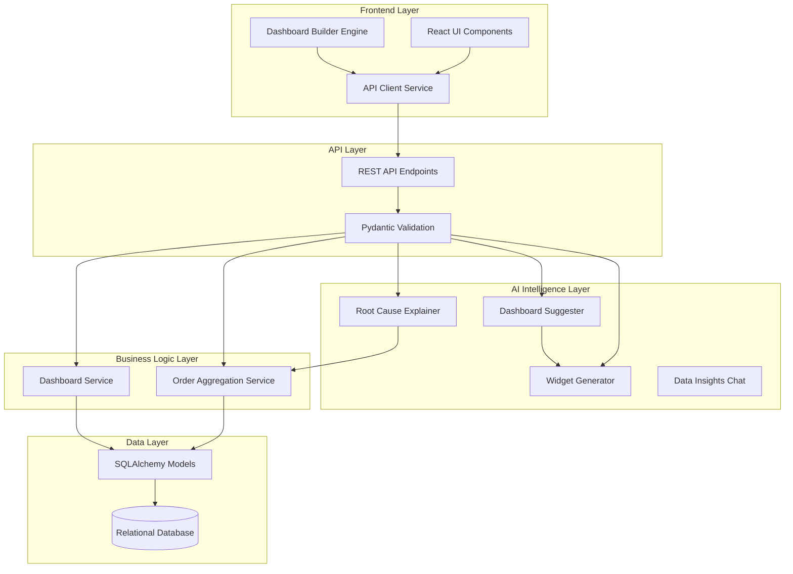

# Design Document: Custom Dashboard Builder

## Overview
The Custom Dashboard Builder is a production-quality system that enables users to design, visualize, and monitor real-time business metrics dynamically. The system provides a complete solution for dynamic data visualization, featuring a powerful AI Intelligence Layer capable of auto-generating full layouts, parsing natural language to construct custom widgets, explaining data anomalies ("Why is this happening?"), and conversing strictly with live business orders.

The architecture follows a clean, modular design with separation of concerns across presentation (React + Zustand), business logic (FastAPI), AI processing (Gemini 2.5 Flash), and data layers (PostgreSQL/Alembic), providing a highly scalable, maintainable, and production-ready enterprise application.

## Technology Stack

### Backend
- **Framework:** FastAPI 0.109+
- **Database:** PostgreSQL (production ready via `asyncpg`), SQLite (dev fallback)
- **ORM:** SQLAlchemy 2.0+ & Alembic
- **Validation:** Pydantic v2
- **AI:** Google Gemini API (`google-genai`)
- **Authentication:** JWT (`python-jose`) and Password Hashing (`passlib`)
- **Web Server:** Uvicorn

### Frontend
- **Framework:** React 16+ (Vite)
- **Routing:** React Router v6
- **Styling:** TailwindCSS (Vibrant Light & Sleek Dark modes)
- **State Management:** Zustand & React Query (`@tanstack/react-query`)
- **HTTP Client:** Axios
- **Icons:** Lucide React
- **UI/Charts:** Recharts, `react-grid-layout`

## Project Structure

```text
Halleyx_Customerdashboard/
├── backend/
│   ├── alembic/              # Database migration configuration and scripts
│   ├── app/
│   │   ├── api/routes/       # API controllers (ai.py, auth.py, dashboard.py, data.py, orders.py, widgets.py)
│   │   ├── core/             # App configuration, constants, and security utilities
│   │   ├── crud/             # SQLAlchemy ORM Data Access Layer classes
│   │   ├── db/               # Database connection strings, sessions, and Base setup
│   │   ├── models/           # SQLAlchemy Declarative Models mapping strictly to tables
│   │   ├── schemas/          # Pydantic validation boundaries for HTTP Requests/Responses
│   │   └── services/         # Core Logic, Aggregations, and GenAI Integrations
│   ├── tests/                # Pytest suites ensuring algorithmic correctness
│   ├── requirements.txt      # pip dependency mappings (`asyncpg`, `google-genai`)
│   ├── alembic.ini           # Alembic structural settings
│   ├── main.py               # FastAPI application lifecycle and middleware entrypoint
│   └── .env                  # Secret configurations (DB_URL, GEMINI_API_KEY)
├── frontend/
│   ├── src/
│   │   ├── components/       
│   │   │   ├── dashboard/    # Complex layout Canvas, Grid systems, and Tooltips
│   │   │   ├── orders/       # Order Data Tables and transactional UI views
│   │   │   ├── shared/       # Highly reusable atoms (Buttons, Modals, Spinners)
│   │   │   └── widgets/      # Native re-rendering charts mapping to ReCharts
│   │   ├── contexts/         # Context Providers replacing prop-drilling
│   │   ├── hooks/            # Custom abstraction hooks (`useTheme`, `useAuth`)
│   │   ├── pages/            # Top-Level Page routing views (DashboardConfig, Login)
│   │   ├── stores/           # Modern Zustand architecture containing immutable state
│   │   ├── lib/              # API Client instantiations with Axios HTTP Interceptors
│   │   ├── utils/            # Math formatters, validation logic, and CSS helpers
│   │   ├── App.jsx           # Master standard routing wrapper
│   │   ├── main.jsx          # React DOM mounting architecture
│   │   └── index.css         # Global PostCSS directives enabling modern Tailwind modes
│   ├── package.json          # Node registry mapping orchestrator
│   ├── tailwind.config.js    # Tailwind brand color tracking and typography injections
│   └── vite.config.js        # Vite compilation and HMR performance engine
├── Dockerfile                # Specialized Backend build layer containerization
├── docker-compose.yml        # Local orchestration executing dependencies simultaneously
├── render.yaml               # Cloud PaaS production declarative mapping
├── vercel.json               # Vercel Serverless optimized routing hooks
└── README.md                 # Primary design specifications
```

## Quick Start

### Prerequisites
- Python 3.9+ 
- Node.js 18+
- PostgreSQL instance (or local SQLite)
- Google Gemini API key

### Backend Setup
Navigate to the backend directory:
```bash
cd backend
```

Create and activate a virtual environment:
```bash
python -m venv venv
source venv/bin/activate  # On Windows: venv\Scripts\activate
```

Install application dependencies:
```bash
pip install -r requirements.txt
```

Configure your environment:
```bash
cp .env.example .env
# Open .env and insert your database string and GEMINI_API_KEY
```

Apply migrations (optional, if using full PostgreSQL schema rules):
```bash
alembic upgrade head
```

Run the API:
```bash
uvicorn main:app --reload
```
The Backend operates natively at `http://localhost:8000`. API structure documentation available directly at `http://localhost:8000/docs`.

### Frontend Setup
Navigate to the frontend workspace:
```bash
cd frontend
```

Install node packages:
```bash
npm install
```

Start the Vite development engine:
```bash
npm run dev
```
The Application will boot and become available at `http://localhost:5173`.


## Design Principles
- **Separation of Concerns:** Routes, Services, Models, Schemas.
- **Security First:** Strict JWT architecture, salted password hashing (`passlib`), strict input validation.
- **AI-Native Experience:** Integrating large language models heavily into frontend interaction components seamlessly instead of traditional modals.
- **Scalability:** Abstracted service layer resolving heavily nested async tasks.
- **Responsiveness First:** UI scaling beautifully to mobile sizes relying entirely on complex Tailwind grids.

## Architecture

The system follows a fundamentally layered architecture handling massive dynamic queries:



## 🤖 AI Integration & Features

The Custom Dashboard Builder leverages **Google Gemini 2.5 LLM** natively through the `google-genai` pip distribution.

### Core Features
- **AI Widget Generator**: Natural Language to Chart configuration. Simply type "Show me revenue by product as a pie chart" and the widget is automatically assembled and populated with live data.
- **Dashboard Suggester**: A one-click "magic wand" that architecturally crafts a beautiful 6-widget starter layout perfectly mapped to the database schema when starting from an empty canvas.
- **Data Insights Chat**: A conversational Data Analyst sidebar panel. Contextually aware of live data.
- **Root Cause Explainer ("Why is this happening?")**: Binds a "Sparkle" action to every generated widget. Captures aggregate bounds naturally to fetch recent raw rows—shipping it to the LLM to statistically analyze causal correlations without manual searches.
- **Graceful API Key Rotation**: Automatic queue pooling multiple Gemini keys to transparently prevent downtime from severe rate-limits (HTTP 429).
- **Interactive Dashboard Builder**: 12-column drag-and-drop grid layout using `react-grid-layout`.
- **7 Dynamic Widget Types**: Native rendering for KPI Cards, Bar Charts, Line Charts, Area Charts, Pie Charts, Scatter Plots, and Data Tables.
- **Order Management CRUD**: High-performance pagination with editable customer order records.
- **Glassmorphic UI**: Beautiful vibrant colors and seamless toggling.

## API Documentation
Complete Swagger documentation is immediately generated and exposed securely:
- **Interactive docs:** http://localhost:8000/docs
- **ReDoc:** http://localhost:8000/redoc

## Database Schema
Key Tables included within the project architecture:
- `users` - Secure JWT Authentication mappings
- `dashboards` - Bound layout container metadata
- `widgets` - Deep JSONB schema configurations defining user views
- `customer_orders` - Root metrics for analytics operations

Detailed relationships define strict Cascades ensuring child-records (such as widgets) are removed when user environments shift.

## Security Features
- Strict JWT token-based authentication mapping HTTP headers deeply.
- SHA-256 bcrypt password hashing with unique environment salts.
- Pydantic bounds evaluation locking variable injection.
- SQLAlchemy AST bindings structurally eliminating malicious SQL inputs (SQL Injection prevention).
- React frontend sanitization strictly eliminating stored XSS issues.
- Deep CORS configuration restricting external domain hooks.

## Analytics & Tracking
Automatically processes live metrics natively:
- Daily/Monthly total counts and generated Revenue aggregations
- Multi-Dimensional Product analytics grouping
- Live performance analysis (Order scaling volumes)
- System interaction telemetry dynamically parsed by internal logic hooks

## Deployment

The application utilizes standardized environment builds (`Dockerfile` & `docker-compose.yml`) ensuring high interoperability strings. See platform-specific instructions via `render.yaml` and `vercel.json`.

**Deployment Options:**
- Traditional remote server configurations via Ubuntu (Nginx + Systemd)
- Docker Swarm / Container engines
- Cloud providers (Railway, Render, Vercel, AWS ECS)

## Future Enhancements
**Phase 2**
- Webhook pipeline ingestion
- Native PDF Export mapping (Automated Report Generation)
- Data Collaboration channels ("Share Dashboard via Link")
- Custom threshold email alerts

**Phase 3**
- Native Advanced Mobile App integration (React Native wrappers)
- Massive scalability mappings (ClickHouse DB Migration)
- Snowflake / Redshift analytical connectors

## Scalability
- **PostgreSQL Connection Pooling** heavily tuned for async workers (`asyncpg`).
- **Distributed Rendering Framework** heavily delegating UI strain directly to browsers while retaining minimal API payloads.
- Architecture strongly supports future integration paths to Redis (Caching layers) and Celery for extended asynchronous background jobs.

## Contributing
This system is designed as a rigorous, modern production environment showcase. Contributions, PRs, and suggestions covering advanced analytical capabilities are deeply appreciated!

## License
Developed for enterprise software education and architectural demonstration purposes. All rights reserved.

## Contact
For architectural queries or collaboration scopes:
- Platform Maintainer Documentation: Ensure to assess the root backend models configurations directly linked inside `app/schemas` and `app/db` to view pure logic constraints.

## Acknowledgments
- **Google Gemini AI** for fueling the intelligent, self-repairing UI structures and rapid generative capabilities.
- **FastAPI** for powering pure asynchronous execution flawlessly mapping types.
- **React & TailwindCSS** for granting rapid, beautiful visual layouts inherently.
- **Recharts** community allowing for highly scalable native visual canvas drawings.
